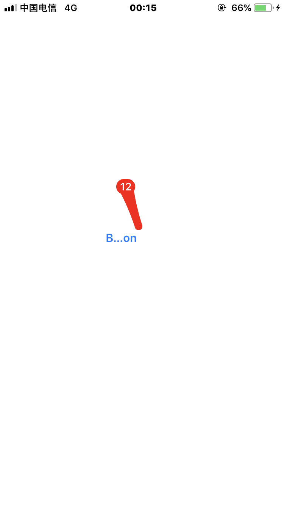

# BadgeView.iOS


library from : https://github.com/zhanglinfeng/LFKit.

The badge lib is a sub lib of LFKit.

## Screen-Shots



## Example

```C#
        partial void UIButton197_TouchUpInside(UIButton sender)
        {
            BadgeView.iOS.LFBadge badge = new BadgeView.iOS.LFBadge();
            badge.Count = "12";
            badge.NeedDisappearEffects = true;
            badge.ClearBlock = new Action(()=> { });
            badge.AddToView(sender);
        }
```

## Important

the function 'drag to dismiss' works well only when 'ClearBlock' has value.
